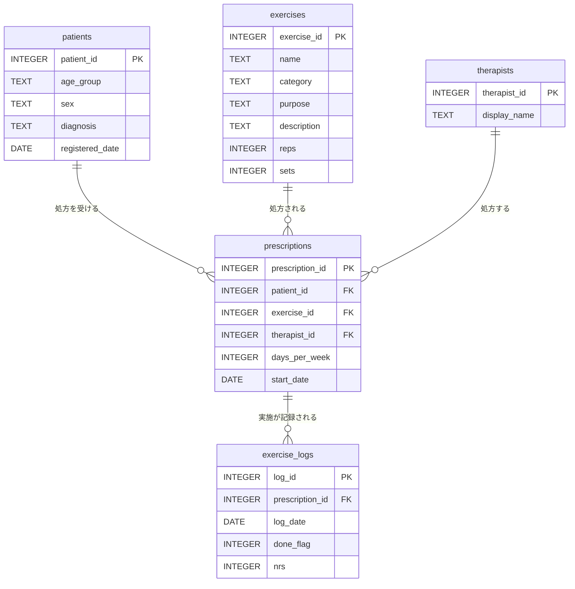

# ER図

```mermaid
erDiagram
    patients ||--o{ prescriptions : "処方を受ける"
    exercises ||--o{ prescriptions : "処方される"
    therapists ||--o{ prescriptions : "処方する"
    prescriptions ||--o{ exercise_logs : "実施が記録される"

    patients {
        INTEGER patient_id PK
        TEXT age_group
        TEXT sex
        TEXT diagnosis
        DATE registered_date
    }
    therapists {
        INTEGER therapist_id PK
        TEXT display_name
    }
    exercises {
        INTEGER exercise_id PK
        TEXT name
        TEXT category
        TEXT purpose
        TEXT description
        INTEGER reps
        INTEGER sets
    }
    prescriptions {
        INTEGER prescription_id PK
        INTEGER patient_id FK
        INTEGER exercise_id FK
        INTEGER therapist_id FK
        INTEGER days_per_week
        DATE start_date
    }
    exercise_logs {
        INTEGER log_id PK
        INTEGER prescription_id FK
        DATE log_date
        INTEGER done_flag
        INTEGER nrs
    }
```
